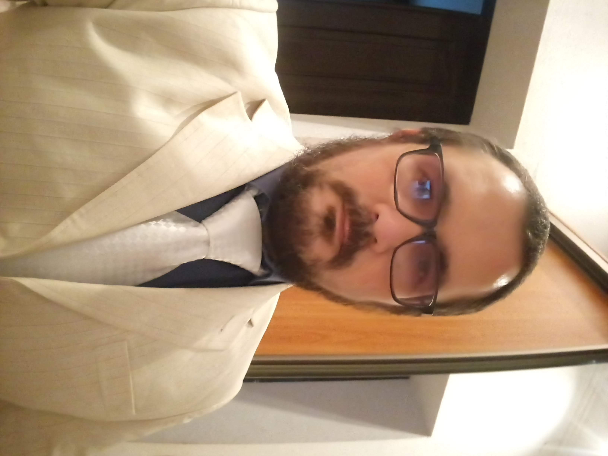
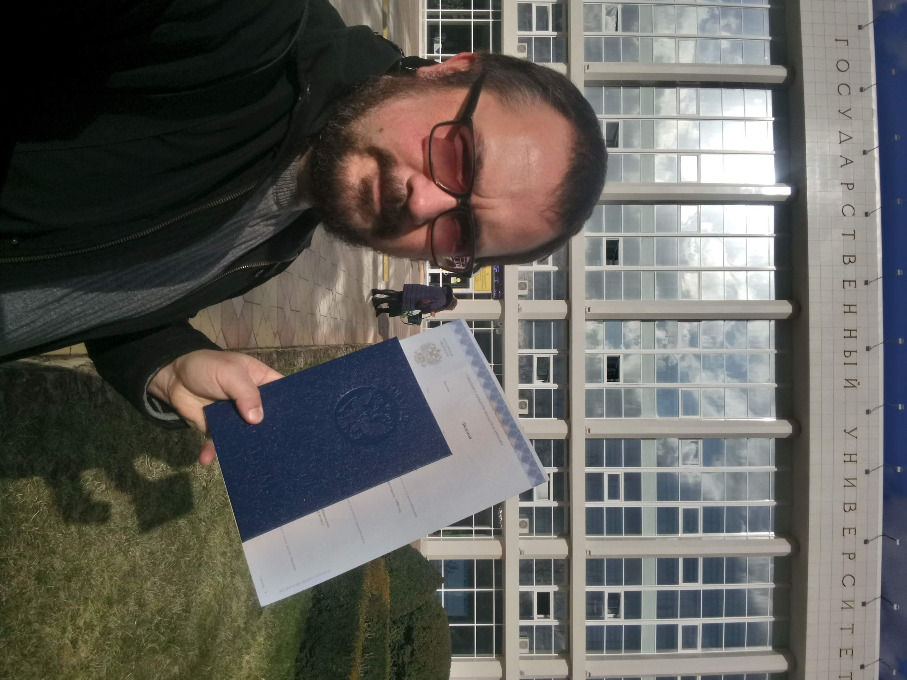
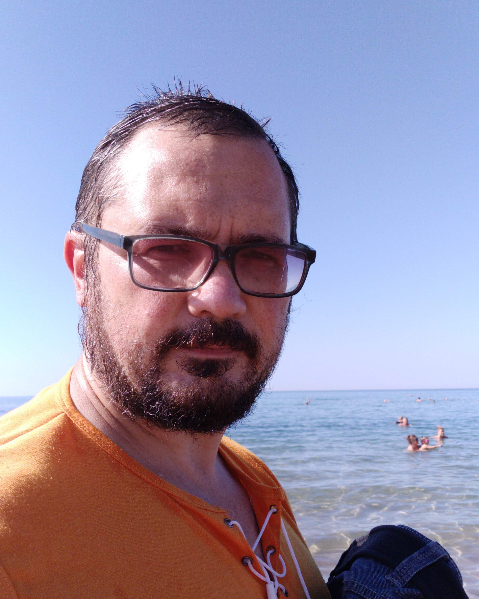

# Let's get acquainted
## I'm a nomad in the stream of life

### Some words about myself

- много переезжал с самого детства: разные страны, города повидал
- много разных работ испытал: от продавца техники и сторожа до учителя английского языка и дорожного рабочего  
   
- учился в разных заведениях и школах  

- работал на море и на крышах  
 
  
- а теперь осваиваю Phyton-кодинг в Нетологии. Наверное, скоро буду выглядеть примерно так:  

### Something not too important, but perhaps  interesting, too

- люблю играть в разные игры (настольные, мобильные, компьютерные)
- интересны фильмы в жанре фантастики, фэнтези, приключения
- мне кажется, если бы в нашем мире была магия, то я мог бы быть примерно таким вот магом:  

А может, и нет, кто знает? Но мечтать не вредно.
Конечно, у меня есть определенные цели, и программирование - один из шагов на пути к ним.  
На этом все, можете покурить.   
Огоньку?  
